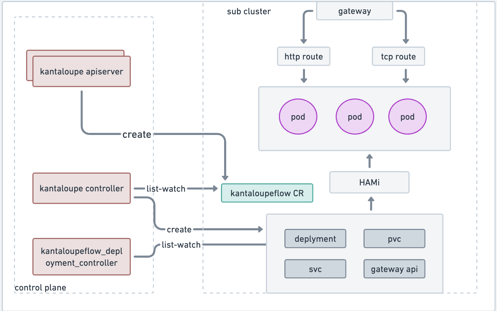
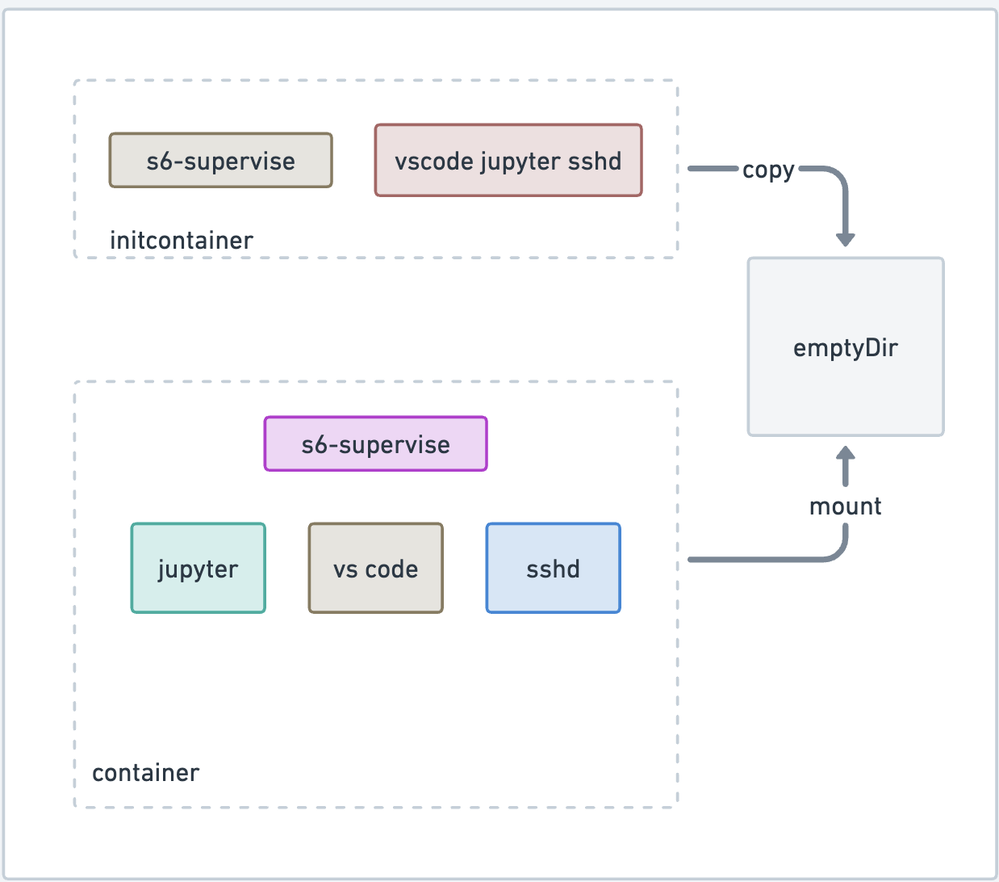

## AI 工作负载架构图

控制面：
1. 通过 kantaloupe apiserver 创建 AI 工作负载的 CR
2. kantaloupe controller 处理 CR，创建 AI 工作负载的 deployment，数据集。如果使用 vscode 和 jupyter，ssh 等工具，并创建相关的路由信息。

数据面：
1. pod 通过 HAMi 调度后，如果开启了 vscode，jupyter 和 ssh 等工具，通过 gateway 路由，将请求负载到具体的 pod 里。

## vscode jupyter，ssh 实现细节

1. 通过 initcontainer 把 vscode，jupyter 和 sshd 等二进制等文件通过 emptyDir 共享。container 挂载这个 emptyDir 将文件共享到自己的目录中。

2. 因为 jupyter 需要 python 解释器，在 container 启动的时候通过 PostStart hook 点去安装 python 解释器。

## kantaloupe controller

kantaloupe controller 主要负责将 AI 工作负载运行起来，创建 deployment，svc 等一些资源。如果添加了 vscode，jupyter，ssh 等工具，controller 将会自动注入 initcontainer 并挂载 emptyDir 来共享二进制和配置文件。并创建 service 资源来负载请求到 pod 中，目前先支持 NodePort 类型的 service，后续将使用统一的网关进行请求负载。

## kantaloupe deployment controller

kantaloupe 主要根据 deployment 的实时数据来同步 kantaloupe 的状态。当前工作负载的状态，pod 启动情况。 
