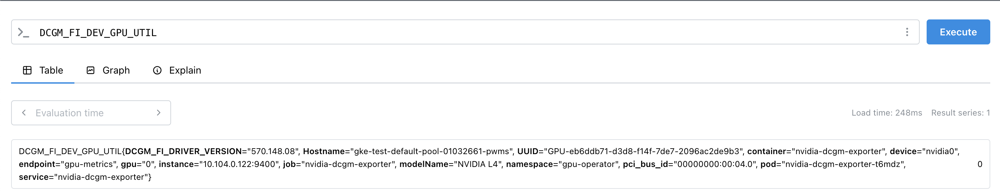
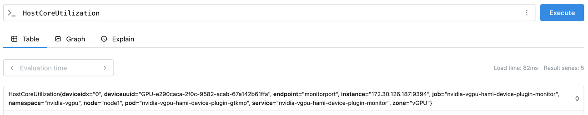
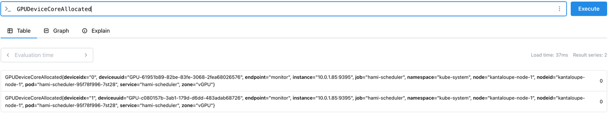
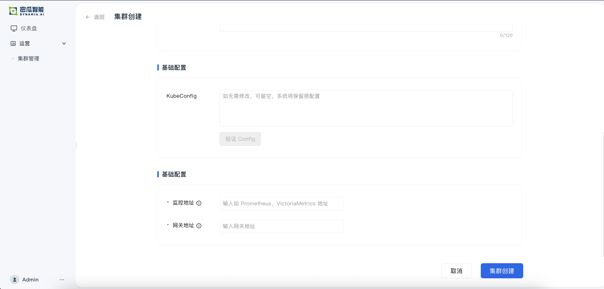

# Kantaloupe 系统要求和前置安装

## 概述

本文档介绍如何准备和接入 Kubernetes 集群到 Kantaloupe 平台。

### Kantaloupe 简介

Kantaloupe 是部署在 Kubernetes 集群之上的 Kubernetes 应用程序，具有以下特点：

- 连接到云端的 Kantaloupe 控制平面
- 提供管理、监控和用户控制界面
- 支持单个客户拥有多个集群，统一管理

请确保您的 Kubernetes 集群满足系统要求和网络要求，然后继续进行 Kantaloupe 安装或集群接入。

## 系统要求

### GPU 支持

**支持的 GPU 卡**
- 兼容 GPU 驱动版本 440 及以上
- 确保 GPU 设备满足该要求以保证最佳性能和兼容性


### 容器运行时

Kantaloupe 兼容以下容器运行时：
- `containerd`（Kubernetes 默认运行时）
- `Docker`

确保 Kubernetes 集群已正确配置其中之一。详细说明请参考 [官方文档](https://kubernetes.io/zh-cn/docs/concepts/workloads/pods/pod-lifecycle/#container-states)


### 存储要求

**共享存储**

Kantaloupe 工作负载需要统一访问来自任何计算节点的数据，用于：
- 训练数据
- 代码存储
- 检查点
- 权重及其他机器学习相关工件

**支持的存储协议**
- 网络文件存储（NFS）（可选）

详细说明请参考 [Kubernetes NFS 官方文档](https://kubernetes.io/zh-cn/docs/concepts/storage/volumes/#nfs)


### Helm

**要求**：Helm 3.14 或更高版本

**安装方式**：
```bash
curl -fsSL -o get_helm.sh https://raw.githubusercontent.com/helm/helm/master/scripts/get-helm-3 && chmod 700 get_helm.sh && ./get_helm.sh
```

详细安装指南请参考 [Helm 官方安装文档](https://helm.sh/docs/intro/install/)


## 组件安装

### 1. Prometheus 监控

Kantaloupe 依赖 Prometheus 进行集群监控，支持使用外部或新建 Prometheus。

**快速安装**：
```bash
helm repo add prometheus-community https://prometheus-community.github.io/helm-charts
helm repo update

helm install prometheus prometheus-community/kube-prometheus-stack \
    -n monitoring --create-namespace --set grafana.enabled=false \
    --version=75.15.1
```

> **注意**：如果使用外部 Prometheus，请确保其版本为 2.37.0 或更高版本。

### 2. NVIDIA GPU Operator

由于 HAMi 使用增强版本的 device-plugin，需要禁用 GPU Operator 的 device-plugin。

**安装步骤**：

1. 添加 NVIDIA Helm 仓库并安装：
```bash
helm repo add nvidia https://helm.ngc.nvidia.com/nvidia && helm repo update

helm install --wait --generate-name \
    -n gpu-operator --create-namespace \
    nvidia/gpu-operator \
    --set devicePlugin.enabled=false \
    --set dcgmExporter.serviceMonitor.enabled=true \
    --version=v25.3.0
```

2. 功能验证

进入 nvidia-driver-daemonset Pod 验证 GPU 驱动：
```bash
kubectl -n gpu-operator exec -it $(kubectl get pods -n gpu-operator -l app=nvidia-driver-daemonset -o name | head -1) -- /bin/bash
```

在 Pod 中执行 `nvidia-smi` 命令，正确安装应显示：
```bash
root@nvidia-driver-daemonset-msg42:/# nvidia-smi 
Mon Mar 17 08:09:48 2025
+-----------------------------------------------------------------------------------------+
| NVIDIA-SMI 550.144.03             Driver Version: 550.144.03     CUDA Version: 12.4     |
|-----------------------------------------+------------------------+----------------------+
| GPU  Name                 Persistence-M | Bus-Id          Disp.A | Volatile Uncorr. ECC |
| Fan  Temp   Perf          Pwr:Usage/Cap |           Memory-Usage | GPU-Util  Compute M. |
|                                         |                        |               MIG M. |
|=========================================+========================+======================|
|   0  Tesla P4                       On  |   00000000:03:00.0 Off |                  Off |
| N/A   31C    P8              6W /   75W |       0MiB /   8192MiB |      0%      Default |
|                                         |                        |                  N/A |
+-----------------------------------------+------------------------+----------------------+
                                                                    
+-----------------------------------------------------------------------------------------+
| Processes:                                                                              |
|  GPU   GI   CI        PID   Type   Process name                              GPU Memory |
|        ID   ID                                                               Usage      |
|=========================================================================================|
|  No running processes found                                                             |
+-----------------------------------------------------------------------------------------+
```

**故障排除**：如遇问题请参考 [NVIDIA GPU Operator 故障排除指南](https://docs.nvidia.com/datacenter/cloud-native/gpu-operator/latest/troubleshooting.html)


### 3. HAMi

首先先申请 HAMi 商业版的离线安装包，包含 helm 包和镜像，首先将镜像导入到当前集群中。

1. 使用 Helm 安装：
```bash
helm install hami hami.tgz -n hami-system --create-namespace \
      --set scheduler.serviceMonitor.enabled=true \
      --set devicePlugin.serviceMonitor.enabled=true
```

2. 启用 GPU 节点：
想在固定节点使用 HAMi，需要在节点上添加 `gpu: on` label 开启 gpu 功能。HAMi device plugin 会自动在开启 gpu 的节点上启动。

```bash
# 为需要使用 GPU 的节点添加标签
kubectl label nodes <node-name> gpu=on
```

### 4. ServiceMonitor 配置

确保 Prometheus 能够采集 HAMi 和 DCGM-Exporter 指标。

> **重要**：ServiceMonitor 的 label 需要与 Prometheus 资源的 `spec.serviceMonitorSelector` 字段匹配。

#### 验证监控数据

配置完成后，通过 Prometheus 查询以下指标验证数据采集：

1. **验证 dcgm-exporter 数据**：
   查询 `DCGM_FI_DEV_GPU_UTIL`
   

2. **验证 hami-exporter 数据**：
   查询 `HostCoreUtilization`
   

3. **验证 hami-device-plugin-exporter 数据**：
   查询 `GPUDeviceCoreAllocated`
   

**故障排除**：如无法获取指标，请检查 Exporter 安装情况和 ServiceMonitor 配置，确保正确关联并被 Prometheus 采集。

### 5. Gateway API

Gateway API 用于路由 VSCode、SSH 和 Jupyter 等服务请求。

**选项 A：使用现有网关**

如果集群已有 Istio、Envoy 等支持 Gateway API 的网关，请提供网关 endpoint。

**选项 B：使用 Envoy Gateway**

> 📖 更多信息：[Envoy Gateway 安装指南](https://gateway.envoyproxy.io/docs/install/install-helm/)


## 接入集群

完成所有组件安装后，在 Kantaloupe 控制台进行集群接入：

### 接入流程

1. 登录 Kantaloupe 控制台
2. 进入"集群管理" → "集群接入"
3. 填写集群基础信息
4. 上传 KubeConfig 文件
5. 配置监控和网关地址
6. 点击"创建集群"完成接入



### 接入重要参数

| 参数 | 说明 | 示例 |
|------|------|------|
| **KubeConfig** | 集群访问凭证 | 集群 kubeconfig |
| **监控地址** | Prometheus 服务端点 | `http://prometheus.monitoring:9090` |
| **网关地址** | Gateway API 端点 | `http://gateway.envoy-system` |
